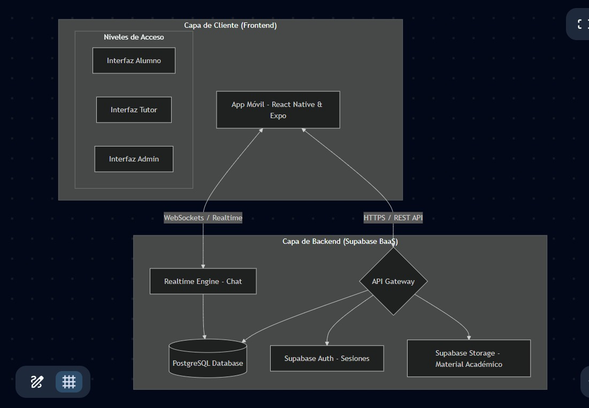

# TutorPal UDB 

**TutorPal UDB** es una solución integral diseñada para optimizar la conexión entre estudiantes y tutores dentro del ecosistema universitario de la **Universidad Don Bosco**. Esta plataforma facilita la gestión de tutorías, el intercambio de material académico y el seguimiento del progreso estudiantil.

---

##  Integrantes - Grupo G1 (Teórico 01T)

* **Bryan Otoniel Loarca Montenegro** (LM252002) - *Coordinador*
* **Josue Engelberto Alfaro Trinidad** (AT251699)
* **Fernando Alexander Juárez Coto** (JC252637)
* **Danilo Ernesto Velado Mena** (VM251328)
* **Josue Vladimir Águila Méndez** (AM240357)

---

##  Enlaces del Proyecto

* **Gestión de Proyecto (Trello):** [Tablero TutorPal UDB](https://trello.com/invite/b/69b8dd2f26dcfd19b66de52c/ATTI6dc1c53a549e717d87b81b54f7139f8b83831802/tutorpal-udb-gestion-de-proyecto)
* **Diseños y Mockups (Stitch):** [Prototipo de Interfaz](https://stitch.withgoogle.com/projects/9885823503763955056)
* **Documentación:** [Descargar Perfil de Proyecto PDF](./Perfil-Proyeecto-Catedra%201(Editado)%20(1).pdf)

---

##  Arquitectura del Sistema

*El sistema utiliza una arquitectura moderna basada en:*
* **Frontend:** React Native / Expo (Multiplataforma iOS/Android).
* **Backend as a Service (BaaS):** Supabase (Auth, Database, Storage).
* **Comunicación:** Realtime WebSockets para el chat y REST API.

---

##  Stack Tecnológico

* 
* 
* 
* 

---

##  Licencia

Este proyecto está bajo la Licencia **Creative Commons Atribución-NoComercial-CompartirIgual 4.0 Internacional**.

> Puedes consultar el archivo [LICENSE](./LICENSE) para más detalles sobre la autoría académica y restricciones comerciales.
